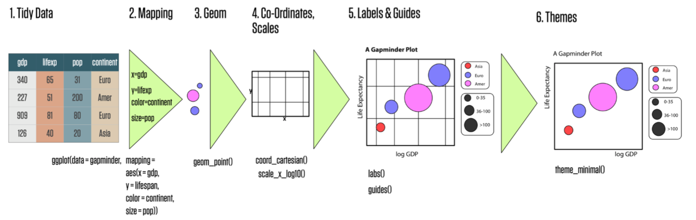

```{r setup, include=FALSE}
knitr::opts_chunk$set(echo = FALSE)
```

```{r libraries, message=FALSE, warning=FALSE}
library(ggplot2)
library(dplyr)
library(rmarkdown)
library(readxl)
library(skimr)
```

```{r, include=FALSE}
knitr::write_bib(file = 'packages.bib')
```

# Known issues

- Make copy of this without the filled in code sections
- fix three_components_of_rmd.png
- can't get packages.bib to work
- label chunks
- get Ted and Daniel's author info
- fix citation style to be numbers not text
- cite Kaggle cereals and smoke data
- cite Allison Horst's stuff/fill out here stuf
- cite Ted's materials
- cite Mara's stuff
- cite R/medicine workshop stuff
- survey???
- distill doesn't support floating TOC
- search and replace all XXX
- remove plot variables

Welcome to R/Medicine 2021. In this workshop we will be doing a hands-on introduction to R for medical data.

# Workshop basics

## Why should I come to this workshop?

-   Learn how your organization can use R

-   Write your first R code!

-   See some highlights of the R ecosystem

## Set up for workshop

You'll need the following during the workshop:

-   A computer with internet connection

-   [A supported browser](https://support.rstudio.com/hc/en-us/articles/227449447-Supported-browsers-for-RStudio-Connect)[^1]

-   An [RStudio Cloud](https://rstudio.cloud/plans/free) account---***free***

[^1]: <https://support.rstudio.com/hc/en-us/articles/227449447-Supported-browsers-for-RStudio-Connect>

**Please note** while you can use a local version of R and Rstudio for the workshop, we cannot provide support for you during the workshop to address issues that come up your local device and software. We use RStudio Cloud because we can do all the technical preparation for participants ahead of time and spend our limited workshop time on learning R as fast as possible.

If you would like to some additional preparation for the workshop, I recommend learning some about [Markdown](https://commonmark.org/help/tutorial/) in this ten minute tutorial.

## Schedule

**Introduction** *\~xxx minutes*

**Systems check** *\~xxx minutes*

**Learn and Do** *\~xxx minutes*

**Wrap Up and Discussion** *\~xxx minutes*

## Starting your journey in R

```{r}
knitr::include_graphics("./images/r_rollercoaster.png")
```

# Orientation

## Systems Check

- Log into RStudio Cloud

- Raise hand in zoom if you are having trouble

## Open up the project

Once you are in RStudio Cloud, click on the project called "Intro to R for Medical Data".

```{r, out.width="100%"}
#knitr::include_graphics("./images/rstudio_cloud_project.png")
```


## RStudio Cloud

For this workshop we will be using RStudio Cloud.

Why? Because there is nothing that you need to download!

You don't **need** to use RStudio to use R, but I do!

RStudio on your computer and RStudio Cloud look very similar.

R and RStudio are free to download to your computer. 

## RStudio Orientation: Basics

```{r, out.width="100%"}
knitr::include_graphics("./images/four_panes.png")
```

## R Markdown Orientation

Let's open the file in the file pane (number 4 in the image above) called `Intro_to_R_for_medical_data_workshop.Rmd`. This is what we will be working for the workshop.

```{r}
knitr::include_graphics("./images/find_the_file.png")
```

Your document will look something like this. 

```{r}
knitr::include_graphics("./images/three_components_of_rmd.png")
```


### YAML

The YAML header contains the special instructions on how to create the output document. We won't do much with it here today, but it is a very powerful way to make your Rmd file as bespoke as you want it!

### Code Chunks

Code chunks are where the code will go. 

Code chunks have a gray background. 


```{r code_chunk, echo=TRUE}
#This is a code chunk!
#Here is a simple calculation
1 + 2

```
You can run a code chunk by pressing the green play button.

```{r}
knitr::include_graphics("./images/code_chunk.png")
```

# Graphing Data

## Load data into R

XXX smoke data from XXX with data dictionary here XXX put in link.

```{r import_smoke_complete}

smoke_complete <- read_excel("./data/smoke_complete.xlsx")
```

## Inspecting a data frame

One thing that Excel does well is to provide an interactive visual representation of the data. This allows you to inspect it by sorting and filtering. RStudio actually does this well, too, with one difference - it won't let you *change* any of the data while you inspect it.

Look on the right at the *Environment* pane (you might have to click icon that looks like a spreadsheet on the "Environment" tab) and find the entry *smoke_complete*. This is the data frame you just created inside of R's memory. (If you don't see smoke_complete, try running the code chunk above again).

Within the *Environment* pane, click on the *smoke_complete* to view the data.

Go ahead and try to edit one of the values in this viewer. You will find that you can't. It would have been easy for the RStudio programmers to allow editing of specific values, but they decided not to add that feature. 

Why do you think this was designed that way?

Next we will use the glimpse fu
```{r glimpse}
glimpse(smoke_complete)
```


```{r skim}

skim(smoke_complete)
```

## Plotting our data

Now we will take the 

Produce a scatter plot of `smoke_complete` using `geom_point()`, mapping these variables to the following aesthetics:`year_of_birth` to the `x` aesthetic, `cigarettes_per_day` to the `y` aesthetic, and `gender` to the `color` aesthetic.

```{r scatter_plot, error = TRUE, echo=TRUE}

plot_1 <- ggplot(data = smoke_complete,
                 aes(x =  year_of_birth,
                     y =  cigarettes_per_day,
                     color =  gender)) +
  geom_point()

plot_1
```
We've made a plot, but there are some issues with it: 

- there's no title 
- can't read x-axis labels
- suspected overplotting of points


Ideas on how we could make this better?

- titles, fix labels, jitter

```{r beautify_plot_2}

plot_2 <- ggplot(smoke_complete,
                 aes(x =  year_of_birth,
                     y =  cigarettes_per_day,
                     color =  gender)) +
  geom_point()

plot_2

plot_3 <- ggplot(smoke_complete,
                 aes(x =  year_of_birth,
                     y =  cigarettes_per_day)) +
stat_bin2d(bins = 25) +
  facet_wrap(. ~ gender)

plot_3
```

## `ggplot2`: A Grammar of Graphics

`ggplot2` is an extremely powerful software library for visualization.

The `gg` is short for Grammar of Graphics, which means that visualizations are expressed in a specific and consistent way for different types of visualizations in the package.

Here's a visual summary of the different parts we're talking about today.

```{r}

```

Image from [Kieran Healy](https://kieranhealy.org/)

## Learning to read `ggplot2` code

A `ggplot2` graphic consists of a `mapping` of variables in `data` to the `aes()`thetic attributes of `geom_`etric objects.

In code, this is translated as:

```{r example_ggplot2, eval=FALSE, echo=TRUE}
    #start the plot object with ggplot()

    ggplot(data = smoke_complete) +   

    # map the variables to visual properties of the graph]
   

          aes(
            
    # map the x-axis to year_of_birth
              x = year_of_birth, 
              
    # map the y-axis to cigarettes_per_day       
              y = cigarettes_per_day,
    
    # map the color to the gender variable
              color = gender
              ) +

    # add the geometry
      geom_point()
```

Things to note: we chain these three things together with `+` (plus sign).


# Part 2: Wraggling Data

Rarely is your data going to be in the form you need it to be analyzed and plotted. You will often need to wrangle your data and change the shape of it a bit. 

Let's discuss a bit different ways we might need to reshape data.

*Discussion*

There are different packages and ways people wrangle data with R, but we're going to demonstrate using some packages from the tidyverse, which is a whole ecosystem of R packages organized around having *tidy* data. 


## select()

```{r select}
select(smoke_complete, gender, days_to_death)   # select columns to keep
```

```{r}
smoke_complete %>% select(gender, days_to_death) 
```


## filter()

```{r}
filter(smoke_complete, bcr_patient_barcode == "TCGA-18-3412")  # filter to specific rows
```

```{r}
smoke_complete %>% filter(bcr_patient_barcode == "TCGA-18-3412")
```


## %>%

```{r}
smoke_complete %>% 
	filter(year_of_birth <= 1960) %>% 
	select(age_at_diagnosis, gender)
```


## mutate()

```{r}
smoke_complete %>%
	mutate(months_to_death = )
```


1. Filters to tests from the clinic (`clinic_name`) of "picu"

2. Selects the column with the received-to-verified turnaround time (`rec_ver_tat`) as well as the day from start of the pandemic (`pan_day`)

```{r }
_________ %>% # name of data goes here
  filter(_______) %>% 
  select(________, ________) 
```

Use mutate with %>% to create a new column named "total_tat" containing the total turnaround time for each test (sum of `col_rec_tat` and `rec_ver_tat`).

```{r}
________ %>%
	mutate(total_tat = ________)
```

# Quick preview rmarkdown

R Markdown documents, like this document, allow you to place text and analysis with the code all in a single document and output the result into different formats such as an html webpage, a pdf, or even a word document. 

Let's quickly knit this document to see the output. This template is something called a distill template, but many different types are available, and you can customize it to your needs. 


# Wrap up 

## Further Reading and Resources

## How to search for help


## Acknowledgments {.appendix}

This work was made possible by the distill[@allaire2018distill], ggplot, dplyr, and rmarkdown packages. xxx

The data used in this workshop came from Kaggle xxx

## Author Contributions {.appendix}
