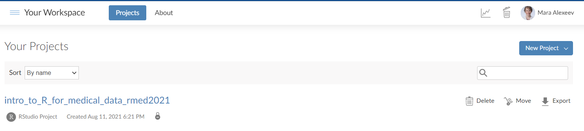
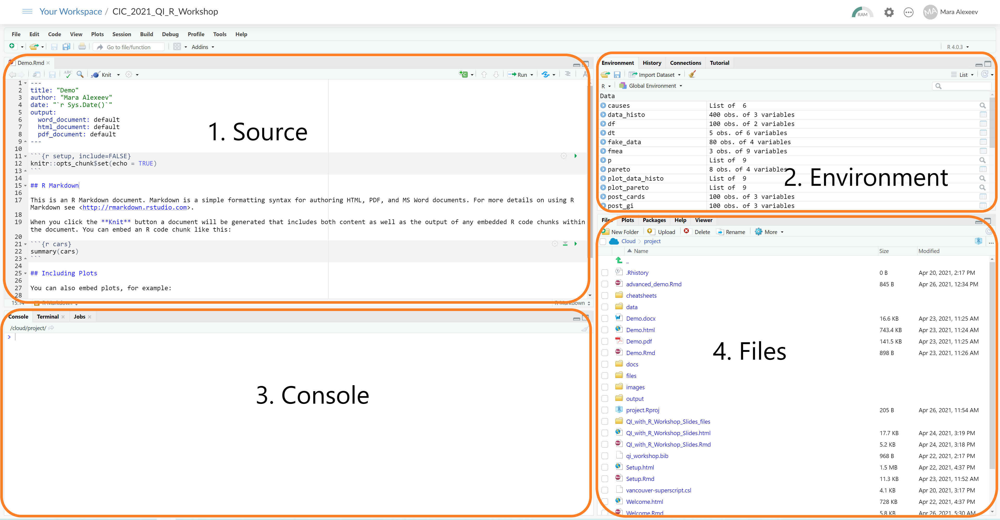
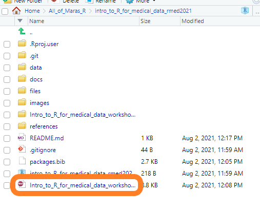
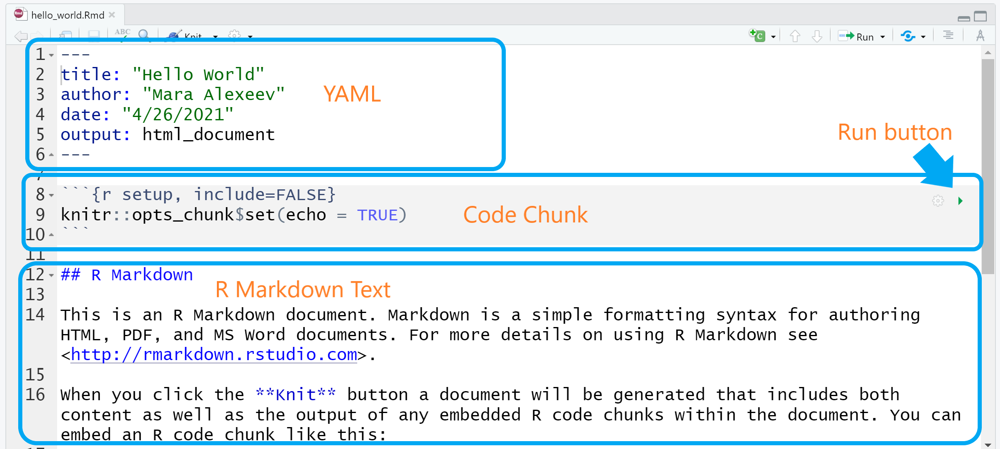
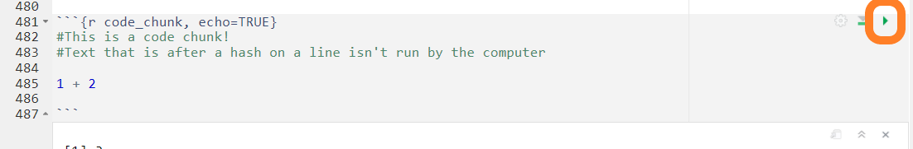
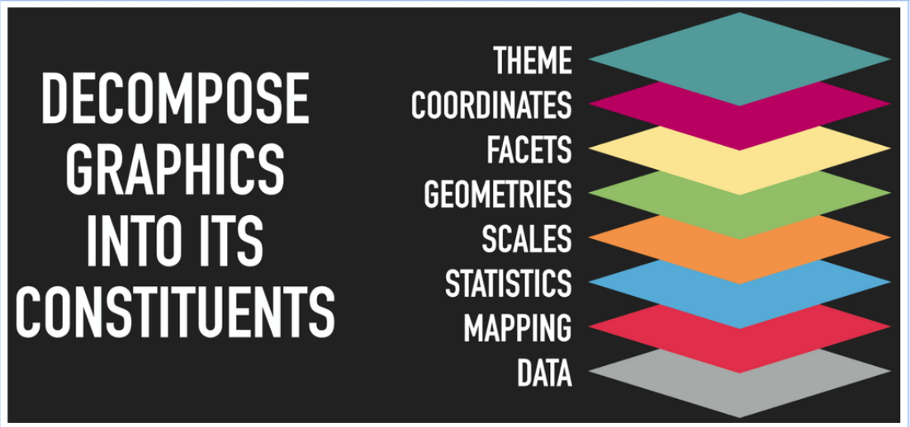
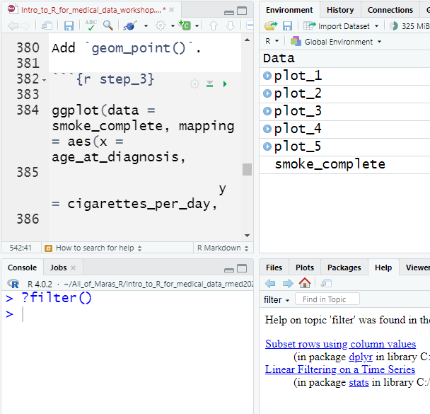
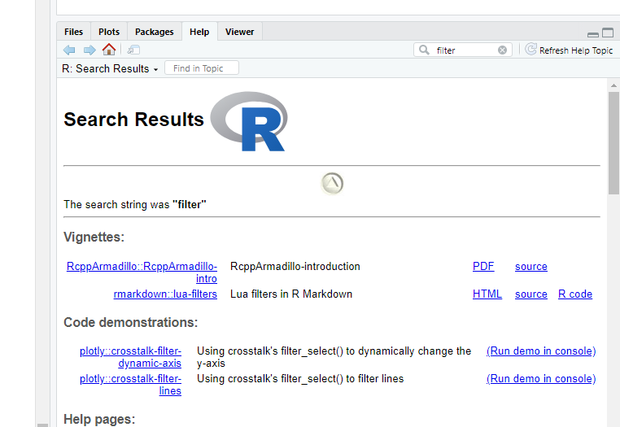

```{r setup, include=FALSE}
knitr::opts_chunk$set(echo = FALSE)
```

```{r libraries, message=FALSE, warning=FALSE}
library(ggplot2)
library(dplyr)
library(rmarkdown)
library(readxl)
library(skimr)
library(kableExtra)
```

```{r, include=FALSE}
knitr::write_bib(file = 'packages.bib')
```

# Known issues

- Make copy of this without the filled in code sections
- fix three_components_of_rmd.png
- can't get packages.bib to work
- label chunks
- get Ted and Daniel's author info
- fix citation style to be numbers not text
- cite Kaggle cereals and smoke data
- cite Allison Horst's stuff/fill out here stuf
- cite Ted's materials
- cite Mara's stuff
- cite R/medicine workshop stuff
- survey???
- distill doesn't support floating TOC
- search and replace all XXX
- remove plot variables

Welcome to R/Medicine 2021. In this workshop we will be doing a hands-on introduction to R for medical data.

# Workshop basics

## Why should I come to this workshop?

-   Learn how your organization could use R

-   Write your first R code!

-   See some highlights of the R ecosystem

## Set up for workshop

You'll need the following during the workshop:

-   A computer with internet connection

-   [A supported browser](https://support.rstudio.com/hc/en-us/articles/227449447-Supported-browsers-for-RStudio-Connect)[^1]

-   An [RStudio Cloud](https://rstudio.cloud/plans/free) account---***free***

[^1]: <https://support.rstudio.com/hc/en-us/articles/227449447-Supported-browsers-for-RStudio-Connect>

**Please note** while you can use a local version of R and Rstudio for the workshop, we cannot provide support for you during the workshop to address issues that come up your local device and software. We use RStudio Cloud because we can do all the technical preparation for participants ahead of time and spend our limited workshop time on learning R as fast as possible.

If you would like to some additional preparation for the workshop, I recommend learning some about [Markdown](https://commonmark.org/help/tutorial/) in this ten minute tutorial.

## Schedule

**Introduction** *\~10 minutes*

**Systems check** *\~10 minutes*

**Learn and Do** *\~120 minutes*

**Wrap Up and Discussion** *\~10 minutes*

## Starting your journey in R

```{r, echo=FALSE}
knitr::include_graphics("./images/r_rollercoaster.png")
```

# Orientation

## RStudio Cloud

For this workshop we will be using RStudio Cloud.

Why? Because there is nothing that you need to download!

You don't **need** to use RStudio to use R, but I do!

RStudio on your computer and RStudio Cloud look very similar.

R and RStudio are free to download to your computer. 

## Systems Check

- Log into RStudio Cloud

- Raise hand in zoom if you are having trouble

## Open up the project

Once you are in RStudio Cloud, click on the project called "Intro to R for Medical Data".

```{r, out.width="100%", echo=FALSE}

```


## RStudio Orientation: Basics

```{r, out.width="100%", echo=FALSE}

```

## R Markdown Orientation

Let's open the file in the file pane (number 4 in the image above) called `Intro_to_R_for_medical_data_workshop.Rmd`. This is what we will be working for the workshop.

```{r, echo=FALSE}

```

Your document will look something like this. 

```{r, echo=FALSE}

```


### YAML

The YAML header contains the special instructions on how to create the output document. We won't do much with it here today, but it is a very powerful way to make your Rmd file as bespoke as you want it!

### Code Chunks

Code chunks are where the code will go. 

Code chunks have a gray background. 


```{r code_chunk, echo=TRUE}
#This is a code chunk!
#Here is a simple calculation
1 + 2

```
You can run a code chunk by pressing the green play button.

```{r, echo=FALSE}

```

# Part 1: Exploring Data

## Data in a Excel spreadsheet?

No problem! R can ingest data from lots of locations including from Excel spreadsheets that you might already be very familiar with.

## Load data into R

XXX smoke data from XXX with data dictionary here XXX put in link.

Run the code chunk below by presening that green play button.

```{r import_smoke_complete, echo=TRUE}

smoke_complete <- read_excel("./data/smoke_complete.xlsx")
```

## Inspecting a data frame

One thing that Excel does well is to provide an interactive visual representation of the data. This allows you to inspect it by sorting and filtering. RStudio actually does this well, too, with one difference - it won't let you *change* any of the data while you inspect it.

### Viewing your data

Look on the right at the *Environment* pane (you might have to click icon that looks like a spreadsheet on the "Environment" tab) and find the entry *smoke_complete*. This is the data frame you just created inside of R's memory. (If you don't see smoke_complete, try running the code chunk above again).

Within the *Environment* pane, click on the *smoke_complete* to view the data (*not* the blue arrow).

Go ahead and try to edit one of the values in this viewer. You will find that you can't. It would have been easy for the RStudio programmers to allow editing of specific values, but they decided not to add that feature. 

1. Why do you think this was designed so you cannot edit specific values?

### Getting a quick glimpse

Next we will use the `glimpse()` function to learn about our data.

```{r glimpse}
glimpse(smoke_complete)
```

1. How many rows of data do we have in our data?
2. How many columns are there? What are some of the column names?
3. Can you tell what kind of variable is stored in the columns? 

### Getting quick summary statistics

Next, we will use the `skim()` function to learn even more about our data.

Press the green play button in the code chunk below.

1. What are the different column types we have?
2. What types are in this data?

Look at the mini histograms at the bottom of the output? What can you learn very quickly about your data for the distribution `cigarettes_per_year` variable

```{r skim}

skim(smoke_complete)
```

# Part 2: Plotting our data

Now we will take the data we have loaded and make some plots!

Produce a histogram of `smoke_complete` using `geom_histogram()`, `mapping` these variables to the following aesthetics:`cigarettes_per_day` to the `x` aesthetic.
Save this plot to the variable `plot_1` and show it.

```{r scatter_plot, error = TRUE, echo=TRUE}

plot_1 <- ggplot(data = smoke_complete,
                 aes(x =  cigarettes_per_day)) +
  geom_histogram()

plot_1
```

We've made a plot, but there are some issues with it: 

- there's no title 
- the axis labels are not in a pretty format


Let's make our plot a bit prettier. 

- Give your plot a nice title using `labs`
- Create better labels for the x and y axes using `labs`
- Add the `theme_classic()` to the plot

```{r beautify_plot_2}

plot_2 <- ggplot(data = smoke_complete,
                 aes(x =  cigarettes_per_day)) +
  geom_histogram() +
  labs(title = "An excellent title for your plot",
       x = "Cigarettes Per Day",
       y = "Count") +
  theme_classic()

plot_2
```
You got a message after running that code that: "`stat_bin()` using `bins = 30`.
Pick better value with `binwidth`."

Let's modify the width of our histogram's bins in the code chunk below to `2`. Then try `10`.

```{r binwidth}
plot_3 <- ggplot(data = smoke_complete,
                 aes(x =  cigarettes_per_day)) +
  geom_histogram(binwidth = 4) +
  labs(title = "An excellent title for your plot",
       x = "Cigarettes Per Day",
       y = "Count") +
  theme_classic()

plot_3
```
Finally let's explore the differences in daily cigarettes for the `gender` variable
by adding a `fill` color and `facet_grid`.

Below add `gender` to the facet.

```{r facet}
plot_4 <- ggplot(data = smoke_complete,
                 aes(x =  cigarettes_per_day,
                     fill = gender)) +
  geom_histogram(binwidth = 2) +
  labs(title = "An excellent title for your plot",
       x = "Cigarettes Per Day",
       y = "Count",
       fill = "Gender") +
  theme_classic() +
  facet_grid(. ~ gender)

plot_4 
```


## `ggplot2`: A Grammar of Graphics

`ggplot2` is an extremely powerful software library for visualization.

The `gg` is short for Grammar of Graphics, which means that visualizations are expressed in a specific and consistent way for different types of visualizations in the package. There is a wonderful universe of complementary packages in R that extend ggplot to many different types of visualizations.

Here's a visual summary of the different parts we're talking about today. There are many parts to visualizations, but many of us don't have the words to describe the different types of parts of a graph. Here we will spend some time breaking down the meeting of different constituent parts.

Note: there are different ways to write `ggplot` code to get the same output, sort of formal versus causal conversation. Here we will focus on the more formal style because it is the most explicit, but also more verbose! As you get familiar with `ggplot`, you will likely shorten your code a bit at times from this very explicit method. We won't cover every layer in depth, but know that breaking down visualizations to these constituents allows for tremendous control. 

```{r, echo=FALSE}

```

Image from [Thomas Lin Pedersen's ggplot2 workshop](https://www.youtube.com/watch?v=h29g21z0a68)


## Learning to read `ggplot2` code

A `ggplot2` graphic consists of a `mapping` of variables in `data` to the `aes()`thetic attributes of `geom_`etric objects.

In code, this is translated as:

```{r full_example, eval=FALSE, echo=TRUE}
    # start the plot object with ggplot()
    # add assign smoke_complete to the data argument

    ggplot(data = smoke_complete,   

    # map the variables to visual properties of the graph
           mapping = aes(
            
    # map the x-axis to age_at_diagnosis
              x = age_at_diagnosis, 
              
    # map the y-axis to cigarettes_per_day       
              y = cigarettes_per_day,
    
    # map the color to the disease variable
              color = disease
              )) +

    # add the geometry and the alpha
          geom_point(alpha = 0.2) + # complete the geom to geom_point
  
    # add labels to your plot

          labs(title = "Age of diagnosis of cancer by daily cigarette consumption", # plot title
               x="Age in days", # x-axis label
               y="Cigarettes per day", # y-axis label
               color = "Disease type") + # label for color legend
  
    # add a facet to your plot
  
          facet_grid(cols = vars(gender)) + # facet by gender variable
  
    # add a theme to your plot
  
          theme_bw()

```

Things to note: we chain these things together with `+` (plus sign).

## Rebuild the prior plot

Set the data argument to `smoke_complete`, then run the code chunk. 

```{r step_1}
ggplot(data = smoke_complete)
```

Add mapping arguments to the `aes` function. Assign the variable `age_at_diagnosis` to `x`, `cigarettes_per_day` to `y`, and `disease` to `color`. 

Run the code chunk. How does it look different from the prior code chunk?

```{r step_2}
ggplot(data = smoke_complete, mapping = aes(x = age_at_diagnosis,
                                            y = cigarettes_per_day,
                                            color = disease))
```
Add `geom_point()`.

```{r step_3}

ggplot(data = smoke_complete, mapping = aes(x = age_at_diagnosis,
                                            y = cigarettes_per_day,
                                            color = disease)) +
      geom_point()
```
Ok, wow, looking great!! Any major differences you notice between the graph provided before the step by step process in code chunk called [full_example](#full_example) above?


In the next modification, modify the `alpha` argument to vary the opacity of the points. You can vary the value from 0 to 1. Try a few different values to see the difference. 

```{r step_4}

ggplot(data = smoke_complete, mapping = aes(x = age_at_diagnosis,
                                            y = cigarettes_per_day,
                                            color = disease)) +
      geom_point(alpha = 0.2)
```
```{r step_5}

plot_5 <- ggplot(data = smoke_complete, mapping = aes(x = age_at_diagnosis,
                                            y = cigarettes_per_day,
                                            color = disease)) +
      geom_point(alpha = 0.2) +

      labs(title = " ", 
           x= " ",  
           y= " ",  
           color = " ") 

plot_5
```

Wait! What little trick was that? See the variable `plot_5` in the code chunk above? That is storing your whole code with your nice new labels. Instead of continuing to rewrite your code, you can just modify as needed. Below we are going to facet by gender to separate out male and female to inspect the differences.

```{r step_6}

plot_5 +
  
      facet_grid(cols = vars(gender)) 
```

Finally we will play a bit with different themes. Pick two of the below themes and then add them to the `plot_5` and run the code chunk to compare them.

Theme options:

- theme_bw()
- theme_light()
- theme_minimal()
- theme_dark()
- theme_void()

```{r step_7}

plot_5 + theme_classic()

plot_5 + theme_dark()
```

There are plenty of out of the box themes in `ggplot2`, but you can make a theme, use other people's, or even use a theme your organization might already have.
Let's load the `ggthemes' library.

```{r ggthemes}
library(ggthemes)
```

```{r ggthemes_playground}

plot_5 + theme_economist() + labs(subtitle = "The Economist Style")

plot_5 + theme_wsj() + labs(subtitle = "WSJ Style")

plot_5 + theme_tufte() + labs(subtitle = "Tufte Style")

```

# Time for a break!!

# Part 3: Wraggling Data

Rarely is your data going to be in the form you need it to be analyzed and plotted. You will often need to wrangle your data and change the shape of it a bit. 

Let's discuss a bit different ways we might need to process data.

*Discussion*

There are different packages and ways people wrangle data with R, but we're going to demonstrate using some packages from the `{tidyverse}`, which is a whole ecosystem of R packages organized around having *tidy* data. 


## select()

From our `smoke_complete` data, let's select two columns to keep: `gender` and `days_to_death`. 

```{r select}
select(smoke_complete, gender, days_to_death)   # select columns to keep
```

There is a lovely package called `magrittr` that was loaded earlier, but includes something called a pipe, that looks like this in code: `%>%` (pronounced "then").
It allows use to call a nicely pipe data and preform lots of tasks on it. 

Run the code below and inspect the output

1. How does it compare to the output from the prior code chunk?

```{r intro_to_pipe}
smoke_complete %>% select(gender, days_to_death) 
```


## filter()

Now let's meet `filter()`. 

```{r}
filter(smoke_complete, bcr_patient_barcode == "TCGA-18-3412")  # filter to specific rows
```

The pipe alternative way. 

```{r}
smoke_complete %>% filter(bcr_patient_barcode == "TCGA-18-3412")
```

Together `select()` and `filter()` will be big workhorses in your data wrangling toolkit. However, at first it is easy to confuse which function does what. 

`select()` selects the columns to stay. 

`filter()` filters the rows to keep that meet certain conditions placed on columns. 
So in the example above, we filtered the data to only keep the rows where the `bcr_patient_barcode` was equal to "TCGA-18-3412". 


## %>%

We meet the pipe `%>%` earlier, but let's see how we can combine multiple pipes in a row to get a more complicated operation done.

```{r}
smoke_complete %>% 
	filter(year_of_birth <= 1960) %>% 
	select(age_at_diagnosis, gender)
```


## mutate()

Let's make `age_at_diagnosis` more human friendly by creating a new column that divides the days by 365.25. (There are great R packages to handle data, times, duration, intervals, and all those other message time and date issues!)

`mutate` also lets you create multiple "mutations" (e.g., calculations) at the same time.

```{r}
table_1 <- smoke_complete %>%
	mutate(age_at_diagnosis_years = age_at_diagnosis/365.25,
	       age_at_diagnosis_years_round = round(age_at_diagnosis_years, 1)) %>% 
  select(age_at_diagnosis, age_at_diagnosis_years, age_at_diagnosis_years_round)

table_1
```

# A moment for beautiful tables

There are several great packages that can make lovely tables that are publication ready.

One quick example here of our prior code chunk output `table_1`. We take that same object and let a package called `kableExtra` work some magic on it!

```{r kableExtra_magic, echo=TRUE}

table_1 %>% 
  head(10) %>% #just to only print the top 10 rows
  kable() %>%
  kable_styling(bootstrap_options = c("striped", "hover"))

```

# Quick preview rmarkdown

R Markdown documents, like this document, allow you to place text and analysis with the code all in a single document and output the result into different formats such as an html webpage, a pdf, or even a word document. 

Let's quickly knit a document to seee the output. In pane 4, or the file pane, find the document called `knit_preview.Rmd` and open it. We will see examples of knitting the same .Rmd file to a word document, a pdf, and to html. 

# Wrap up 

## How to search for help

Within R you can type ? followed by the name of the function eg `?filter()` in the console. 

```{r help_console, echo=FALSE}

```


In RStudio, you can look at the help tab in pane 4. 

```{r rstudio_help, echo=FALSE}

```

However, in the end your best resource is probably going to be searching online for the issue. From online forms, to blog posts, to twitter threads there is a ton of content out there, but crafting a good search query is a workshop in itself!


## Extra: Standardizing variable names: `clean_names()`

The last package we'll talk about today is the `janitor` package. This package adds some really useful functions for *cleaning* data.

The one I use the most is called `clean_names()`. This will mutate column names into a standard format - all character values will be lowercase and spaces will be converted to underscores. 

The `smoke_complete` dataset has already had this function applied to it, but let's create a smaller example dataset where this wouldn't be the case.


```{r}
smoke_bad_colnames <- read_csv("data/smoke_bad_colnames.csv")
smoke_bad_colnames
```

Ack! These column names have spaces, inconsistent capitalization, which make these difficult to work with.

So let's use `clean_names()` to fix this:


```{r}
smoke_good_colnames <- smoke_bad_colnames %>%
    clean_names()

smoke_good_colnames
```

By default, `clean_names()` converts to snake case (spaces between words are replaced by an underscore `_`).  `clean_names()` will help you standardize your dataset's column names. Knowing that everything follows a certain convention will make your data cleaning journey better.


## Further Reading and Resources

[ggplot2: Elegant Graphics for Data Analysis](https://ggplot2-book.org/index.html)

[R for Data Science](https://r4ds.had.co.nz/)

[R Graphics Cookbook](https://r-graphics.org/)

The list is always growing! The trouble isn't finding good resources, it's finding time to read them!


## Acknowledgments {.appendix}

This work was made possible by the distill, ggplot, dplyr, and rmarkdown packages.


## Author Contributions {.appendix}
